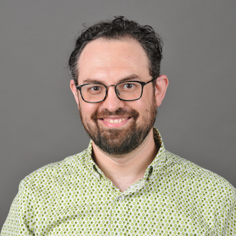
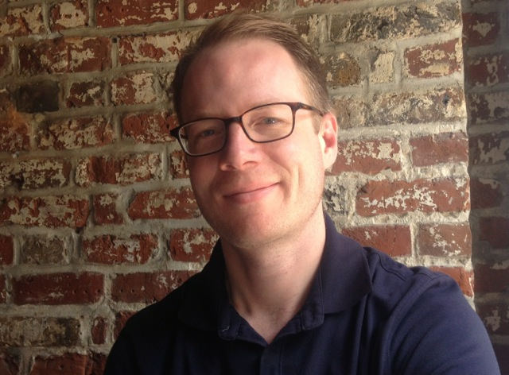
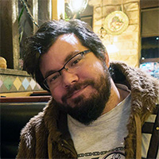
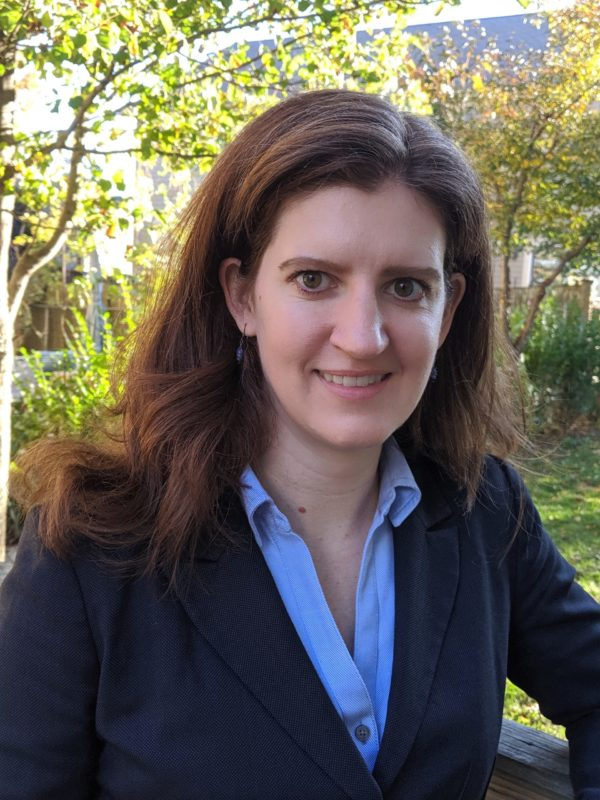
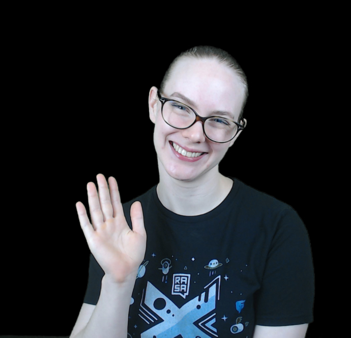
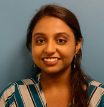
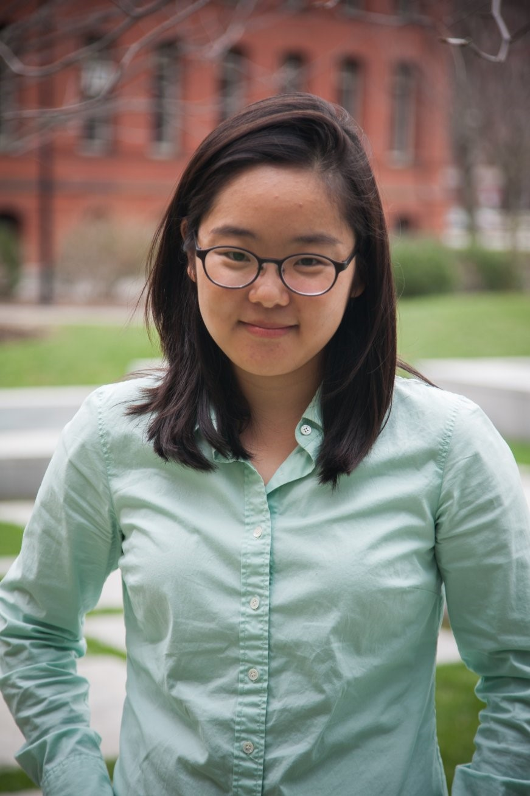
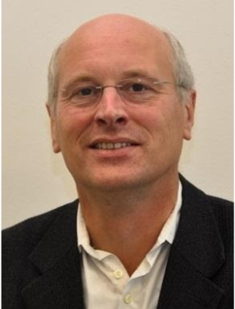
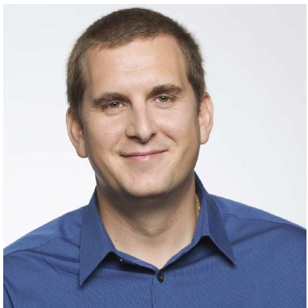

**Session 1: Under-resourced Languages & Literature Speakers**

<html>

<strong id="Krister">Krister Lindén</strong>

</img>

Research Director Krister Lindén has a PhD in Language Technology. He is at the Department of Digital Humanities of the University of Helsinki in Finland. Lindén has directed a number of research projects and is Vice-Team Leader of the Center of Excellence in Ancient Near Eastern Empires. In addition to having developed software for processing resources for the various languages, he has published more than 130 peer-reviewed scientific publications.

 

 

<strong id="Matthew">Matthew Lavin</Strong>

</img>

Matthew J. Lavin is an Assistant Professor of Humanities Analytics in the Data Analytics Program at Denison University. He earned a PhD in English from the University of Iowa in 2012; a master’s degree in American studies at Utah State University in 2006; and a bachelor’s degree at St. Lawrence University in 2002. From 2012 to 2013, Lavin served as a Council on Library and Information Resources (CLIR) Postdoctoral Fellow at the University of Nebraska – Lincoln’s Center for Digital Research in the Humanities (CDRH). From 2013 to 2015, he was Associate Program Coordinator for the Andrew W. Mellon Foundation Initiative “Crossing Boundaries: Re-Envisioning the Humanities for the 21st Century” at St. Lawrence University. From 2015 to 2020, he was a Clinical Assistant Professor of English and Director of the Digital Media Lab at the University of Pittsburgh. Lavin’s scholarship focuses on the intersection of digital humanities, book history, and U.S. literature, in particular using large-scale computational text analysis methods to study 19th and 20th-century periodicals. His publications have appeared in Auto|Biography Studies, Cather Studies, CA: The Journal of Cultural Analytics, Digital Scholarship in the Humanities, The Programming Historian, and Studies in the Novel.

 

 

<strong id="David">David Bamman</Strong>

</img>

David Bamman is an assistant professor in the School of Information at UC Berkeley, where he works in the areas of natural language processing and cultural analytics, applying NLP and machine learning to empirical questions in the humanities and social sciences. His research focuses on improving the performance of NLP for underserved languages and domains like literature (including LitBank and BookNLP) and exploring the affordances of empirical methods for the study of literature and culture. 

 

 

**Session 2: NLP in the Social Sciences Speakers**

<strong id="Ken">Ken Benoit</strong>

</img>

Kenneth Benoit is Professor of Computational Social Science in the Department of Methodology at the London School of Economics and Political Science, and Professor (Part-time) in the School of Politics and International Relations, Australian National University. He has previously held positions in the Department of Political Science at Trinity College Dublin and at the Central European University (Budapest). He received his Ph.D. (1998) from Harvard University, Department of Government. His current research focuses on computational, quantitative methods for processing large amounts of textual data, mainly political texts and social media. Current interest span from the analysis of big data, including social media, and methods of text mining. His substantive research in political science focuses on comparative party competition, the European Parliament, electoral systems, and the effects of campaign spending. His other methodological interests include general statistical methods for the social sciences, especially those relating to measurement. Recent data large-scale measurement projects in which he has been involved include estimating policy positions of political parties through crowd-sourced data, expert surveys, manifesto coding, and text analysis.

 

 

<strong id="Chris">Chris Kennedy</Strong>

</img>

Chris Kennedy is a postdoctoral fellow in surgical informatics at Harvard Medical School, with a PhD in biostatistics from UC Berkeley. His research interests include medical AI and targeted causal inference; he is a research affiliate at Beth Israel Deaconess Medical Center, Kaiser Permanente, D-Lab, and the Integrative Cancer Research Group. In 2018 he was the principal data science consultant for the election campaigns of Gavin Newsom and Katie Porter.

 

 

<strong id="Laura">Laura Nelson</Strong>

</img>

Laura Nelson is an Assistant Professor of Sociology, in the College of Social Sciences and Humanities, at Northeastern University.  She is also core faculty at the NULab for Text, Maps, and Networks; a Faculty Affiliate at the Network Science Institute; an Executive Committee member of the Women’s, Gender, and Sexuality Studies Program; and a member of the Editorial Board of Signs. Nelson uses computational tools, principally automated text analysis, to study social movements, culture, gender, institutions, and organizations. She is an open source and open science enthusiast, seeking to use open-source tools and computational methods to make the social sciences and humanities more transparent, reproducible, and scalable.

 

 

**Session 3: NLP in Theory and Application Speakers**

<strong id="Rada">Rada Mihalcea</Strong>

</img>

Rada Mihalcea is a Professor of Computer Science and Engineering at the University of Michigan and the Director of the Michigan Artificial Intelligence Lab. Her research interests are in computational linguistics, with a focus on lexical semantics, multilingual natural language processing, and computational social sciences. She serves or has served on the editorial boards of the Journals of Computational Linguistics, Language Resources and Evaluations, Natural Language Engineering, Journal of Artificial Intelligence Research, IEEE Transactions on Affective Computing, and  Transactions of the Association for Computational Linguistics. She was a program co-chair for EMNLP 2009 and ACL 2011, and a general chair for NAACL 2015 and *SEM 2019. She currently serves as ACL Vice-President. She is the recipient of a Presidential Early Career Award for Scientists and Engineers awarded by President Obama (2009) and an ACM Fellow (2019). In 2013, she was made an honorary citizen of her hometown of Cluj-Napoca, Romania.

 

 

<strong id="Rachael">Rachael Tatman</Strong>

</img>

 Dr. Rachael Tatman is a Senior Developer Advocate for Rasa, where she helps developers use open source tools to build chatbots that really work. She lives in Seattle & had a little mutt named Benson. You can find her most easily on Twitter @rctatman.

 

 

**Session 4: Health & Life Sciences Speakers**

<strong id="Nishitha">Nishitha Kambhaladinne</Strong>

</img>

Nishitha Kambhaladinne is a data science analyst in Janssen, a pharmaceutical company of Johnson & Johnson. She is part of the Commercial Data Sciences and Data Management Team. Nishitha joined Janssen through the Technology Leadership Development Program where she completed her rotations in data science. In her role, she works on a diversified portfolio of projects including real world data analytics, machine learning to drive patient adherence and NLP pipelines. Nishitha holds a bachelor’s degree in Economics and Information Technology from Rutgers University. Prior to joining Janssen, she founded a B2C startup for small to medium scale businesses, which was sold in 2017.

 

 

<strong id="Jenna">Jenna Eun</Strong>

</img>

Jenna Eun is a principal data scientist in Janssen, a pharmaceutical company of Johnson & Johnson. She is part of the Commercial Data Sciences, Data Engineering & Data Enablement Leadership Team. In her role, she leads a portfolio of business critical projects, including novel applications of machine learning to drive improved patient adherence, retention and clinical outcome across key products and regions. Jenna holds a bachelor’s degree and a Ph.D. in Biochemistry from the University of Wisconsin- Madison where she conducted research in biophysics, chemical biology, and biomedical engineering. Prior to joining Janssen, she was selected as Helen Hay Whitney Howard Hughes Medical Institute postdoctoral fellow at Harvard University.

 

 

<strong id="Irena">Irena Spasic</Strong>

</img>

 Irena Spasić received the PhD degree in computer science from the University of Salford, UK in 2004. Following posts at the Universities of Belgrade, Salford and Manchester, she joined the Cardiff School of Computer Science and Informatics in 2010, and became a Full Professor in 2016. She leads the text and data mining research theme at Cardiff University, and is a co-founder of the UK Healthcare Text Analytics Research Network. Her research interests include text mining, knowledge representation, machine learning, and information management with applications in healthcare, life sciences, and social sciences.

 

 

<strong id="Sjaak">Sjaak Brinkkemper</Strong>

</img>

 Sjaak Brinkkemper is full professor of Software Production at the Department of Information and Computing Sciences of Utrecht University, the Netherlands. He leads a group of about twenty-five researchers specialized in product software development and software entrepreneurship. The main research themes of the group are methodology of software production, implementation and adoption, and techno-economic aspects of the software industry.  Brinkkemper has published about 10 books and over 200 papers in his research interests: software production, requirements engineering, software architecture, and method engineering. He is/was on the program committees of CAiSE, ICSOC, ECIS, RE, REFSQ, ICSOB, and serves on the steering committee of CAiSE, ECIS, and ICSOB. He serves and served on the Editorial Boards of: Journal Information and Software Technology, Journal of Database Management, Business Informatics, MIS Quarterly, European Journal of Information Systems. Journal on Information Systems and e-Business Management, Requirements Engineering journal. In 2018 he established the Care2Report research program that aims at developing multi-modal conversation summarization systems for structured meetings in several domains.

 

 

**Session 5: Real World NLP Speakers**

<strong id="Ines">Ines Montani</strong>

</img>

Ines Montani is a developer specializing in tools for AI and NLP technology. She’s the co-founder of Explosion and a core developer of spaCy, a popular open-source library for Natural Language Processing in Python, and Prodigy, a modern annotation tool for creating training data for machine learning models.

 

 

<strong id="Julia">Julia Silge</strong>

</img>

Julia Silge is a data scientist and software engineer at RStudio PBC where she works on open source modeling tools. She is an author, an international keynote speaker, and a real-world practitioner focusing on data analysis and machine learning practice. Julia loves text analysis, making beautiful charts, and communicating about technical topics with diverse audiences. 

 

 

<strong id="Claudiu">Claudiu Branzan</strong>

</img>

Claudiu Branzan is a Machine Learning Engineering Senior Manager within the Applied Intelligence group at Accenture, based in Seattle, where he leverages his more than 15 years of experience in data science, machine learning, and AI to promote the use and benefits of these technologies to build smarter solutions to complex problems with a focus on unstructured data processing. He leads the data science team for the West region. Previously, Claudiu held highly technical client-facing leadership roles in companies using big data and advanced analytics to offer solutions for clients in healthcare, high-tech, telecom, and payments industries.

</html>

